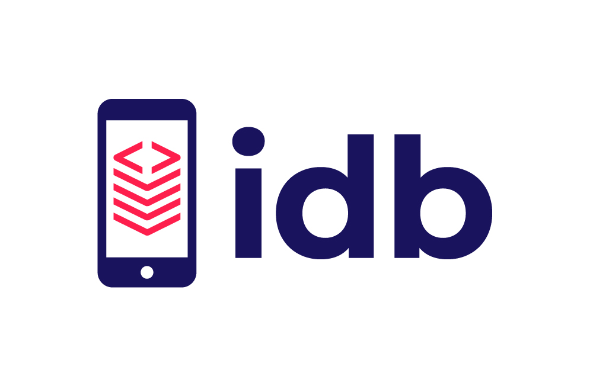

# idb



The "iOS Development Bridge" or `idb`, is a command line interface for automating iOS Simulators and Devices. It has three main priniciples:

* *Remote Automation*: `idb` is composed of a "companion" that runs on macOS and a python client that can run anywhere. This enables scenarios such as a "Device Lab" within a Data Center or fanning out shards of test executions to a large pool of iOS Simulators.
* *Simple Primitives*: `idb` exposes granular commands so that sophisticated workflows can be sequenced on top of them. This means you can use `idb` from an IDE or build an automated testing scenario that isn't feasible with default tooling. All of these primitives aim to be consistent across iOS versions and between iOS Simulators and iOS Devices. All the primitives are exposed over a cli, so that it easy to use for both humans and automation.
* *Exposing missing functionality*: Xcode has a number of features that aren't available outside it's user interface. `idb` leverages many of Private Frameworks that are used by Xcode, so that these features can be in GUI-less automated scenarios.

`idb` is built on top the `FBSimulatorControl` and `FBDeviceControl` macOS Frameworks, contained within this repository. These Frameworks can be used independently of `idb`, however `idb` is likely to provide the simplest install and the most sensible defaults for most users.

We've given a talk about `idb` at F8, so that you can learn more about what `idb` is and why we built it. A [recording of the talk is available here](https://developers.facebook.com/videos/2019/reliable-code-at-scale/).

## Quick Start

`idb` is made up of 2 major components, each of which needs to be installed separately.

### `idb` companion

Each target (simulator/device) will have a companion process attached allowing `idb` to communicate remotely.

The `idb` companion can be installed via brew or built from [source](https://github.com/facebook/idb)

```
brew tap facebook/fb
brew install idb-companion
```
Note: Instructions on how to install brew can be found [here](https://brew.sh)

### `idb` client

A cli tool and python client is provided to interact with `idb`.

It can be installed via pip:

```
pip3.6 install fb-idb
```
Note: The idb client requires python 3.6 or greater to be installed.

Please refer to [fbidb.io](https://www.fbidb.io/) for detailed installation instructions and a guided tour of idb.

Once installed, just run the list-targets command which will show you all the simulators installed on your system:

```
$ idb list-targets
...
iPhone X | 569C0F94-5D53-40D2-AF8F-F4AA5BAA7D5E | Shutdown | simulator | iOS 12.2 | x86_64 | No Companion Connected
iPhone Xs | 2A1C6A5A-0C67-46FD-B3F5-3CB42FFB38B5 | Shutdown | simulator | iOS 12.2 | x86_64 | No Companion Connected
iPhone Xs Max | D3CF178F-EF61-4CD3-BB3B-F5ECAD246310 | Shutdown | simulator | iOS 12.2 | x86_64 | No Companion Connected
iPhone Xʀ | 74064851-4B98-473A-8110-225202BB86F6 | Shutdown | simulator | iOS 12.2 | x86_64 | No Companion Connected
...
```

`list-apps` will show you all the apps installed in a simulator:

```
$ idb list-apps --udid 74064851-4B98-473A-8110-225202BB86F6
com.apple.Maps | Maps | system | x86_64 | Not running | Not Debuggable
com.apple.MobileSMS | MobileSMS | system | x86_64 | Not running | Not Debuggable
com.apple.mobileslideshow | MobileSlideShow | system | x86_64 | Not running | Not Debuggable
com.apple.mobilesafari | MobileSafari | system | x86_64 | Not running | Not Debuggable
```

`launch` will launch an application the application:

```
$ idb launch com.apple.mobilesafari
```

Head over [to the main documentation](https://www.fbidb.io) for more details on what you can do with idb and the full list of commands.

## Building from Source

`idb` is made up of 2 parts.

To build the python part make sure you are in the root of the repo and run:

```
pip3 install .
```

To build the objective-c/c++ part:

Make sure you have installed gRPC dependencies: ```brew tap grpc/grpc && brew install grpc```

```
open idb_companion.xcworkspace
```

This will open an Xcode project that you can build and run.

After opening the Xcode project you will need to add a `--udid` argument for launch.
- Get the UDID of either your device or simulator
  - Window -> Devices and Simulators
  - Select the device or simulator you care about
  - Copy the value in the `Identifier` section of the header
- Project -> Scheme -> Edit Scheme (or `cmd + <`)
- Run -> Arguments
- Click the `+` under the `Arguments Passed on Launch` section
- Enter `--udid <UDID copied above>`
- Run the `idb_companion` target on `My Mac`

Once `idb_companion` has launched, it will output the TCP port upon which the companion has bound to `stdout`:

```
{"grpc_port":10882}
```

By default this port is `10882`, it can be bound on a random port with `--port 0` or a port of your choosing. You'll now be able to direct `idb` commands against this companion with the `IDB_COMPANION` environment variable passed to the cli:

```
$ IDB_COMPANION=localhost:10882 idb describe
```

As long as you prefix this environment variable before all commands, you'll be able to run commands against the companion that you're currently debugging within Xcode.

## Documentation

Find the full documentation for this project at [fbidb.io](https://www.fbidb.io/)

## Contributing

We've released `idb` because it's a big part of how we scale iOS automation at Facebook. We hope that others will be able to benefit from the project where they may have needs that aren't currently serviced by the standard Xcode toolchain.

## Code of Conduct

Facebook has adopted a Code of Conduct that we expect project participants to adhere to. Please [read the full text](https://code.fb.com/codeofconduct) so that you can understand what actions will and will not be tolerated.

## Contributing Guide

Read our [contributing guide](.github/CONTRIBUTING.md) to learn about our development process.

## License

[`idb` is MIT-licensed](LICENSE).
