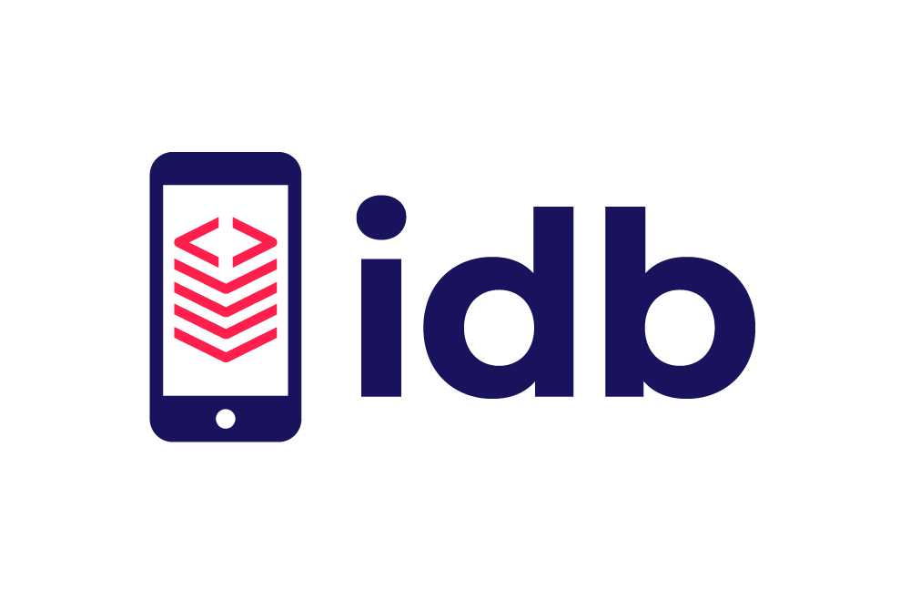

[](https://github.com/facebook/idb/actions/workflows/ci.yml)
[](https://discord.gg/SF26Yqw)

The "iOS Development Bridge" or `idb`, is a command line interface for automating iOS Simulators and Devices. It has three main principles:

* *Remote Automation*: `idb` is composed of a "companion" that runs on macOS and a python client that can run anywhere. This enables scenarios such as a "Device Lab" within a Data Center or fanning out shards of test executions to a large pool of iOS Simulators.
* *Simple Primitives*: `idb` exposes granular commands so that sophisticated workflows can be sequenced on top of them. This means you can use `idb` from an IDE or build an automated testing scenario that isn't feasible with default tooling. All of these primitives aim to be consistent across iOS versions and between iOS Simulators and iOS Devices. All the primitives are exposed over a cli, so that it's easy to use for both humans and automation.
* *Exposing missing functionality*: Xcode has a number of features that aren't available outside its user interface. `idb` leverages many of Private Frameworks that are used by Xcode, so that these features can be in GUI-less automated scenarios.

`idb` is built on top of the `FBSimulatorControl` and `FBDeviceControl` macOS Frameworks, contained within this repository. These Frameworks can be used independently of `idb`, however `idb` is likely to provide the simplest install and the most sensible defaults for most users.

`idb` is transitioning to a pure Swift codebase: the companion is written in Swift, and the Frameworks are migrating from Objective-C. [The architecture documentation](https://www.fbidb.io/docs/idb/architecture) describes where the migration stands.

We've given a talk about `idb` at F8, so that you can learn more about what `idb` is and why we built it. A [recording of the talk is available here](https://developers.facebook.com/videos/2019/reliable-code-at-scale/).

## Quick Start

`idb` is made up of 2 major components, both of which are installed by a single brew formula.

### `idb` companion

Each target (simulator/device) will have a companion process attached allowing `idb` to communicate remotely.

The `idb` companion can be installed via brew or built from [source](https://github.com/facebook/idb)

```
brew install facebook/fb/idb
```
Note: Instructions on how to install brew can be found [here](https://brew.sh)

### `idb` client

A cli tool and python client is provided to interact with `idb`.

It is installed alongside the companion by the brew formula above. It can also be installed separately via pip (releases publish to PyPI):

```
pip3 install fb-idb
```
Note: The idb client requires python 3.11 or greater to be installed.

Please refer to [fbidb.io](https://www.fbidb.io/) for detailed installation instructions and a guided tour of idb.

Once installed, just run the list-targets command which will show you all the simulators installed on your system:

```
$ idb list-targets
...
iPhone X | 569C0F94-5D53-40D2-AF8F-F4AA5BAA7D5E | Shutdown | simulator | iOS 12.2 | x86_64 | No Companion Connected
iPhone Xs | 2A1C6A5A-0C67-46FD-B3F5-3CB42FFB38B5 | Shutdown | simulator | iOS 12.2 | x86_64 | No Companion Connected
iPhone Xs Max | D3CF178F-EF61-4CD3-BB3B-F5ECAD246310 | Shutdown | simulator | iOS 12.2 | x86_64 | No Companion Connected
iPhone Xʀ | 74064851-4B98-473A-8110-225202BB86F6 | Shutdown | simulator | iOS 12.2 | x86_64 | No Companion Connected
...
```

`list-apps` will show you all the apps installed in a simulator:

```
$ idb list-apps --udid 74064851-4B98-473A-8110-225202BB86F6
com.apple.Maps | Maps | system | x86_64 | Not running | Not Debuggable
com.apple.MobileSMS | MobileSMS | system | x86_64 | Not running | Not Debuggable
com.apple.mobileslideshow | MobileSlideShow | system | x86_64 | Not running | Not Debuggable
com.apple.mobilesafari | MobileSafari | system | x86_64 | Not running | Not Debuggable
```

`launch` will launch an application:

```
$ idb launch com.apple.mobilesafari
```

Head over [to the main documentation](https://www.fbidb.io) for more details on what you can do with idb and the full list of commands. There are also instructions on how to [make changes to `idb` including building it from source](https://www.fbidb.io/docs/development).

## Building from Source

### Prerequisites

- **macOS 15+** with **Xcode 26.0+**
- **XcodeGen**: `brew install xcodegen`
- **For idb_companion**: the protobuf compiler and its Swift plugin
  ```
  brew install protobuf swift-protobuf
  ```
  (`build.sh` builds the `protoc-gen-grpc-swift` plugin itself, from a pinned checkout of grpc-swift.)

### Building

```bash
# Build everything and assemble the runnable distribution
./build.sh build

# Or build a subset: frameworks, shims, idb_companion, or a specific framework
./build.sh build frameworks
./build.sh build idb_companion
./build.sh build FBControlCore

# All options
./build.sh help
```

The individual build products are written under `Build/Products/Release`. A
full `./build.sh build` also assembles a self-contained distribution at
`Build/Distribution`, laid out the way `idb_companion` expects at runtime:

```
Build/Distribution/
  idb_companion              # the executable
  *.framework               # frameworks, resolved via @executable_path
  Resources/
    libShimulator-iOS.dylib
    libShimulator-macOS.dylib
    libRepl-iOS.dylib
    libRepl-macOS.dylib
    SimulatorFrameworkBridge
    ReplHost.app
    IDBAPI.swiftinterface
```

`idb_companion` discovers the shims and `SimulatorFrameworkBridge` from the
`Resources` directory next to the executable, so run it from `Build/Distribution`
(or copy that directory as a unit).

### Running Tests

```bash
# Run all tests
./build.sh test

# Test a specific framework
./build.sh test FBSimulatorControl
```

### Regenerating Xcode Projects

The Xcode project files are generated from `project.yml` using XcodeGen. To regenerate without building:

```bash
./build.sh generate
```

## Documentation

Find the full documentation for this project at [fbidb.io](https://www.fbidb.io/)

We also have a [public Discord Server that you can join](https://discord.gg/SF26Yqw)

## Contributing

We've released `idb` because it's a big part of how we scale iOS automation at Facebook. We hope that others will be able to benefit from the project where they may have needs that aren't currently serviced by the standard Xcode toolchain.

## Code of Conduct

Facebook has adopted a Code of Conduct that we expect project participants to adhere to. Please [read the full text](https://code.fb.com/codeofconduct) so that you can understand what actions will and will not be tolerated.

## Contributing Guide

Read our [contributing guide](.github/CONTRIBUTING.md) to learn about our development process.

## License

[`idb` is MIT-licensed](LICENSE).
