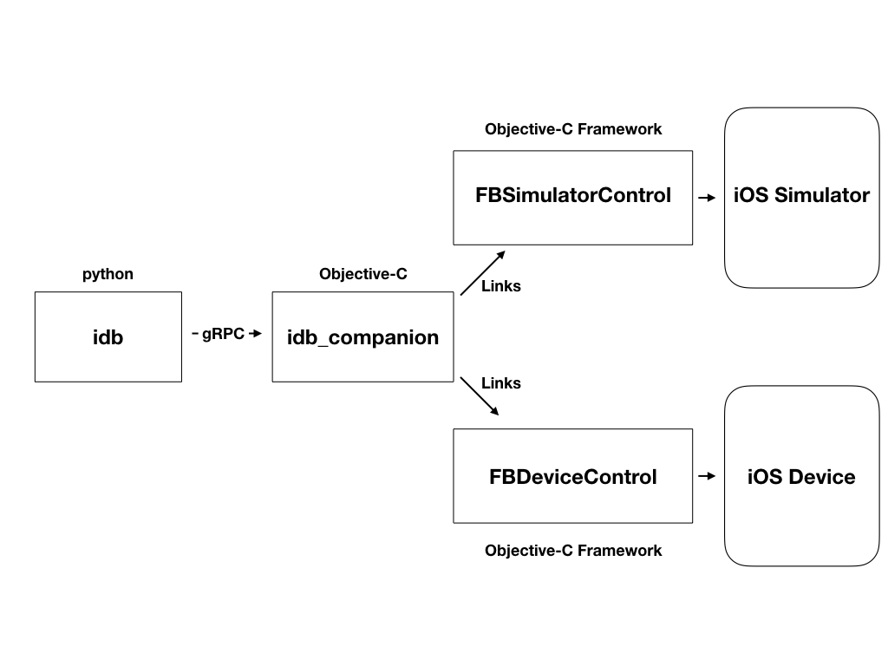

idb is formed of a number of components that have different responsibilities.
## The idb cli

This is a python3 cli that exposes all of the functionality that idb has to offer. As it is written in python, we can run this basically anywhere.
The cli itself just wraps a client class which can also be imported elsewhere. It talks to an idb daemon over gRPC.

## The idb daemon

This is again a python component which can be run just about anywhere. However, it is a stateful component that has awareness of the location of iOS resources.
As a stateful component, it is also responsible for logging and tracing commands that are issued by the client. and is responsible for multiplexing messages between clients and companions. It should run on the same machine as the client.

## The idb_companion

The companion is a gRPC server in Objective-C and C++. It talks to the native APIs that are used for automating Simulators and Devices. It links FBSimulatorControl and FBDeviceControl to perform these tasks.
The companion is paired with a single iOS target (a device/simulator), handles executing the requested commands.

