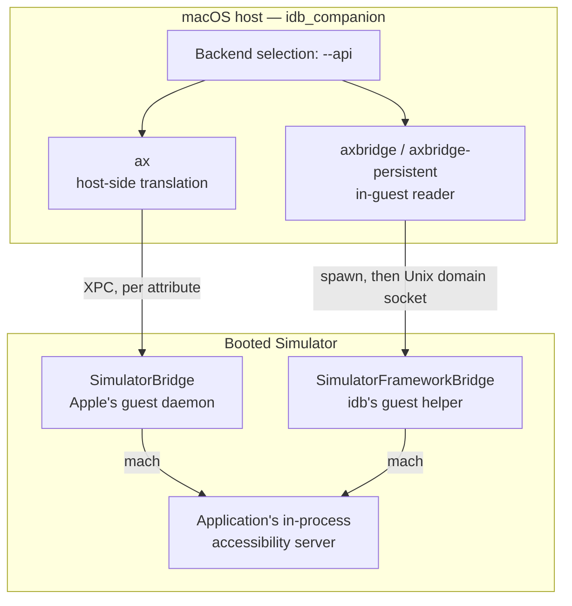
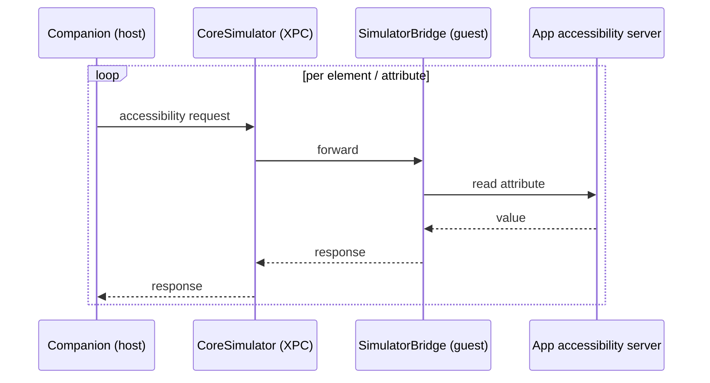
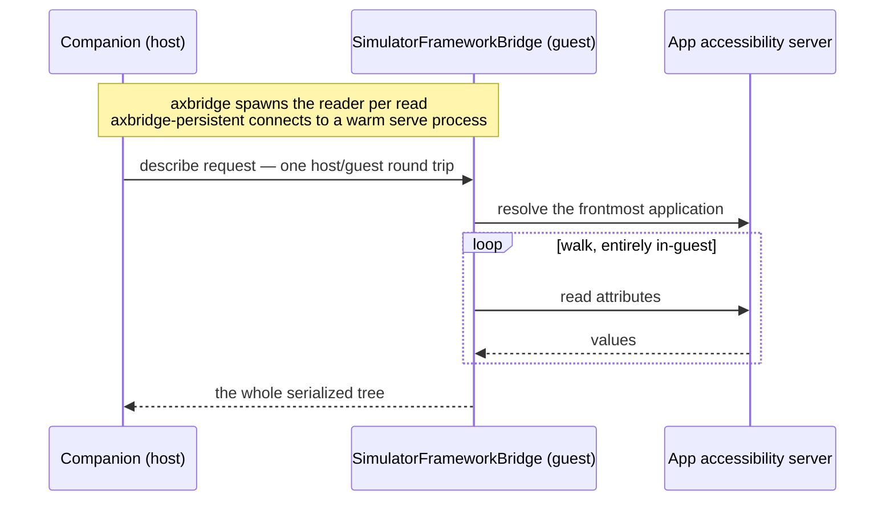

`idb` can read the entire accessibility hierarchy of an iOS Simulator, and act on the elements in it. The commands that do so are documented in [UI Automation](ui.mdx); this page covers what sits behind them — which backend serves a read, what shape the result comes back in, and what to do when a read comes back emptier than the screen looks.

These primitives support a number of scenarios:

- UI testing without `XCTest`, by reading the UI state and then driving the screen.
- Remote access to an iOS Simulator, and screencasting.
- Accessibility auditing, by reading the whole hierarchy and applying heuristics to it.

## Backends

A read is served by one of three backends, selected with `--api` on `idb ui describe-all`, `idb ui describe-point` and `idb ui describe`. They differ in where the read runs, which determines how much of the screen they can see and how much each read costs.

Every backend ultimately reads the same source of truth — the accessibility server running *inside* the target application — but they reach it along different paths:



### `--api ax` — the accessibility backend

The default. The companion asks the Simulator's accessibility server, from the host, for the frontmost application's elements.

This is the same view an assistive technology gets. It is cheap and needs nothing installed in the Simulator, but composed views report as single elements: a view that draws its own content and describes itself with a single label — a custom collection view cell, a composed row of text and images — is reported as that one element, not as the parts it was built from.

The cost model follows from where the read runs: the translation layer on the host fetches lazily, so every element and attribute is its own host-to-guest round trip.



### `--api axbridge` — the guest reader

The read runs *inside* the Simulator. The companion spawns the bundled `SimulatorFrameworkBridge` helper, which attaches to the target application's own in-process accessibility server, walks its element tree, and returns it as JSON.

Because it reads the application from the inside, it sees the structure the application actually built, at the granularity `XCUITest` would see — typed, labelled elements where the host-side view reports one composite. It needs no test bundle, no test runner and no automation daemon: the helper is spawned, answers one read, and exits.

The cost is the spawn: the helper has to start and load the accessibility frameworks on every read, which dominates the time a single read takes — roughly 600ms, against roughly 20ms for the walk itself.

A guest read also puts the target into automation mode and leaves it there — see [Automation mode](#automation-mode).

### `--api axbridge-persistent` — the guest reader, kept warm

The same reader, spawned once instead of once per read. The companion starts `SimulatorFrameworkBridge` in `serve` mode and talks to it over a Unix domain socket, so the framework loading is paid once and every subsequent read is just the walk — around 20ms, roughly 30x faster than re-spawning.

The reader belongs to the companion, not to any one command, so the saving does not require you to hold anything. The first read against a target starts it and the rest are warm, including across separate `idb` invocations, for as long as that companion is running. Measured on a booted simulator: the first `idb ui describe-all --api axbridge-persistent` takes a few seconds, and every one after it lands around 0.2s, against roughly 3.5s each for `--api axbridge`.

`axbridge` is still the better choice when you will genuinely read only once against a freshly started companion, since it does the same work without the socket. Past the first read, prefer `axbridge-persistent`.

The connection is self-healing: if the reader dies — the Simulator shut down, the process was killed — the next read re-establishes it and retries once, rather than wedging on a dead socket.

### Choosing between them

| | `ax` | `axbridge` | `axbridge-persistent` |
|---|---|---|---|
| Where the read runs | Host | Inside the Simulator | Inside the Simulator |
| Detail | Assistive-technology view | Full application tree | Full application tree |
| Cost per read | Low | ~600ms, spawn-dominated | ~20ms warm, after a one-off start |
| Needs `SimulatorFrameworkBridge` | No | Yes | Yes |
| Best for | Quick checks; anything the composite view is enough for | A single read that needs full detail | Any repeated reading against one companion |

### How the axbridge backends fetch the tree

Both axbridge backends ask the application for the whole tree in **one** call. The alternative, one call per node, reads the same tree and the same attributes for more round trips; `profile` reports which one served a read, as `traversal`.

On a 167-element Settings screen the one call costs 1 mach round trip instead of 167, for the same document. On an idle screen the read time is comparable for either traversal (roughly 30ms); the saving is the round trips, so it grows with tree size and with how busy the application is, and it is what a warm `--api axbridge-persistent` reader benefits from — on a one-shot `--api axbridge` read the spawn still dominates.



**A read that asks about reachability takes the per-node walk instead.** The application hit-tests every node to answer `interactable` or `occluded_by`, and a single call asking for them times out rather than answering: on that same idle screen it fails every time at around four seconds, where the walk answers in about 1.6s. Nothing is needed from the caller — such a read reports `traversal: view-hierarchy`. A caller who explicitly asks for the single fetch together with a reachability key is refused with an error naming the keys, rather than left to that timeout.

Narrowing a read with `--key` does not put it on that path unless a reachability key is among the keys asked for — the ordinary attributes are not hit-tested.

`--api ax` is unaffected. It fetches attribute by attribute over XPC and reports no `traversal` at all.

### Compatibility

Omitting `--api` preserves the historical behaviour, and the field is only set on the wire when a backend is asked for. A companion that predates backend selection ignores the field and serves the read as if it were unset.

When a backend is selected but cannot run, the read fails with a clear error rather than falling back to a different one — a silent downgrade would report a smaller tree as if it were the whole screen.

### Requirements

The axbridge backends are iOS Simulator only, and need the `SimulatorFrameworkBridge` helper alongside the companion binary. A companion built as a distribution (see [Development](development.mdx)) has it in the sibling `Resources` directory, which is the layout `idb_companion` expects at runtime; a bare binary moved out of that layout does not, and a read reports:

```
The SimulatorFrameworkBridge guest binary was not found in the companion Resources directory
```

### Read bounds

Whole-tree reads are bounded, so a pathological hierarchy cannot hang a read or return an unbounded payload. The host sets the bounds — a maximum depth of 50 and a budget of 3000 nodes — and both backends truncate at the same point, so a tree read over one is comparable with the same tree read over the other. A read that hit those bounds reports `truncated` in the `complete` format below.

## Output formats

`--format` selects the shape of the result, on the same three read commands.

### `--format default`

The historical format, and what you get if you ask for nothing: a flat JSON array of every element, each a dictionary of attributes under their original `AX`-prefixed names.

```
$ idb ui describe-point 201 286
{"AXFrame":"{{20, 264}, {362, 44}}","AXUniqueId":"com.apple.settings.general","frame":{"y":264,"x":20,"width":362,"height":44},"role_description":"button","AXLabel":"General","content_required":false,"type":"Button","title":null,"help":null,"custom_actions":[],"AXValue":"","enabled":true,"role":"AXButton","subrole":null}
```

A whole-screen read emits an array; a point or marker read emits a bare object, or `null` for a point with nothing under it.

The attributes are `AXLabel`, `AXFrame`, `AXValue`, `AXUniqueId`, `type`, `title`, `frame`, `help`, `enabled`, `custom_actions`, `role`, `role_description`, `subrole`, `content_required`, `pid`, `traits`, `expanded`, `placeholder`, `hidden`, `focused` and `is_remote`. An attribute you did not ask for with `--key` is absent; one that was asked for but has no value is present and `null`.

### `--format nested`

The same elements and the same attribute names, but each element carries its descendants under a `children` key, so the output is one tree rather than a flat list. `--nested` is a deprecated alias for this; pass one or the other, not both.

### `--format complete`

A consolidated document: the elements, plus everything the read learned about the state they were read in.

```
$ idb ui describe General --format complete | jq '{backend, truncated, target, screen}'
{
  "backend": "axbridge",
  "truncated": false,
  "target": {
    "kind": "marker",
    "pid": null,
    "x": null,
    "y": null,
    "value": "General",
    "match_key": "AXLabel"
  },
  "screen": { "width": 402, "height": 874, "coordinate_space": "screen" }
}
```

| Field | Description |
|-------|-------------|
| `elements` | The elements, always an array — even for a single-element read, which the other formats emit as a bare object |
| `backend` | Which backend served the read: `ax`, `axbridge`, `axbridge-persistent`, `axbridge-exclusive` or `testmanagerd`. A read requested as `axbridge-persistent` reports `axbridge-exclusive` when it was served from a bridge the reader holds for itself, which is what the companion does |
| `target` | What was asked for: `kind` is `frontmost`, `application`, `point` or `marker`, with the `pid`, `x`/`y` or `value`/`match_key` that named it |
| `screen` | The bounds element frames are relative to |
| `truncated` | Whether the read hit the depth or node bounds and stopped short of the whole tree |
| `modal` | The blocking alert on screen, if there is one: whether it belongs to the system or the app, its element type, and its title |
| `automation` | The automation mode the read ran in, and whether this read asserted it — see [Automation mode](#automation-mode) |
| `coverage` | How much of the screen the read's element frames cover, along several dimensions. Collected when `--collect-frame-coverage` is passed |
| `profile` | Where the read spent its time, and how many calls it took. Collected when `--profile` is passed — see [Reading `profile`](#reading-profile) |

This format is the easiest one to consume. Its **key set is fixed**: every field is always present, `null` where it does not apply, so one parser handles every read command, and `target` — not the shape — says which command produced the document. Its **element attribute names are the clean ones**: `label` rather than `AXLabel`, `identifier` rather than `AXUniqueId`. Two attributes that restated another are absent: the stringified `AXFrame` (`frame` carries the same rectangle structurally) and the raw `role` (`type` is its normalised form).

The document is expected to grow. New fields are added additively, and a consumer should ignore fields it does not know rather than reject the document; there is deliberately no version to check.

A companion that predates format selection does not recognise `complete` and answers in the default format. `idb` detects that by the response shape and warns on `stderr`:

```
warning: the companion does not support --format complete (it predates format selection); the read was served in the legacy format by the default backend
```

### Reading `profile`

Pass `--profile` on `idb ui describe-all` or `idb ui describe-point` to collect one. It is reported on the `complete` format only — the other formats have nowhere to carry it.

The core is the same on every backend, so two reads served by different backends can be compared:

| Field | What it measures | What it excludes |
|-------|------------------|------------------|
| `element_count` | Elements in the serialized read | Elements walked and then dropped by a filter |
| `total_duration_ms` | Wall time for the whole read | Time in `idb` itself, and the gRPC hop from `idb` to the companion |
| `acquire_duration_ms` | Getting into a position to read at all | Any reading — this is setup, before a single attribute is fetched |
| `read_duration_ms` | Pulling the tree out of the application | Turning what came back into output |
| `serialize_duration_ms` | Turning what was read into the format you asked for | Waiting on the application, which is `read` |

The three phases do not have to add up to the total — a read does small amounts of work between them. In practice they account for 98–100%.

Everything else in `profile` is specific to the backend that served the read, and `backend` says how to read it.

On `ax`, the tree is fetched attribute by attribute over XPC, so the phases decompose like this:

| Field | What it measures |
|-------|------------------|
| `translation_duration_ms` | Obtaining the translation object. A component of `acquire` |
| `element_conversion_duration_ms` | Turning that into a platform element. The other component of `acquire` |
| `attribute_fetch_count` | Attribute reads across the walk — one per property per element |
| `xpc_call_count` | Round trips to the simulator's accessibility service |
| `total_xpc_duration_ms` | XPC wait across the **whole** read. Larger than `read_duration_ms`, which counts only the walk's share — acquisition's XPC is reported as its wall time instead |

On any of the `axbridge` backends, the tree is walked in-process by a guest reader and shipped back as JSON, so the interesting split is transport against traversal:

| Field | What it measures |
|-------|------------------|
| `traversal` | The traversal that produced this read — `view-hierarchy`, `semantic` or `single-fetch`. Read `mach_round_trips` against it: the same tree costs one round trip or one per node depending on the traversal. Which traversal a read gets is described in [How the axbridge backends fetch the tree](#how-the-axbridge-backends-fetch-the-tree) |
| `mach_round_trips` | Round trips to the application's accessibility server |
| `host_decode_duration_ms` | Decoding the guest's JSON response on the host |
| `response_bytes` | Response size. Divided by `acquire_duration_ms`, it gives transport throughput |

On these backends `acquire_duration_ms` is a **residual**, not a measurement: the round trip less the guest's walk, holding acquisition, the guest's JSON encoding and the IPC, undivided. Neither transport separates its own spawn or connect out of it, and on a warm persistent read the residual is mostly encoding and IPC — it is not a connect time.

A `null` here means *this transport does not have this phase* — not that the phase took no time, and not that the field is missing. A phase that took no measurable time reports `0`.

**Divide `read_duration_ms` by `mach_round_trips` before concluding anything.** That ratio is what one query to the application's accessibility server costs, and on a slow read it is the largest term by a wide margin.

**The key set, not the application, is what moves that ratio.** Measured on one running application, one screen, over the per-node walk in both rows so the round trips are the same 118 and the only variable is what was asked for:

| requested | per round trip | total |
|---|---|---|
| ordinary attributes | ~0.14 ms | 16 ms |
| plus `isVisible` / `visiblePoint` | ~18 ms | 2148 ms |

A factor of about 130, from the key set alone. For comparison, an ordinary read of a simple system application runs ~0.18 ms per round trip — indistinguishable from the heavy application's ordinary read. Applications do not differ meaningfully at answering an ordinary query.

The reason is what those attributes mean: `isVisible` and `visiblePoint` cannot be looked up, so the application has to hit-test the element to answer them, and asking for them on a whole tree hit-tests every node.

**Two keys put a read on the expensive path, and nothing else does.** Asking for `interactable` or `occluded_by` widens the fetch list — for every node — with `isVisible`, `visiblePoint`, `centerPoint` and `userInteractionEnabled`; the first two are the ones that cost. `occluded_by` additionally hit-tests the centre of each element already found occluded, a cost proportional to the occluded set rather than to the tree. Every other key set stays on the default fetch list, which carries no reachability and costs milliseconds. On the axbridge backends those same two keys also move the read to the per-node walk, because one call asking for them times out — see [How the axbridge backends fetch the tree](#how-the-axbridge-backends-fetch-the-tree).

**A point read reports no `profile` on the guest lanes.** It resolves one element rather than walking a tree, so there is no traversal to time; `--api ax` does report one. Keep that in mind when comparing a point read's cost across backends.

**Ask about one element, not the whole tree.** The point read already does this: `idb ui describe-point <x> <y> --key interactable` hit-tests that point and reads that element's attributes — one element's worth of hit-testing rather than the tree's, around 18 ms instead of two seconds.

So a live view has two calls rather than one expensive one:

```
# every frame: the cheap read. No reachability, milliseconds.
idb ui describe-all --format complete

# about to act on something: the accurate question, for one element.
idb ui describe-point 201 286 --key interactable
```

The frames from the first give you the point for the second; the point read answers, for the one element you are about to act on, whether it is actually reachable.

**Request reachability per interaction, not per frame.** `isVisible` and `visiblePoint` are priced per node, so a poll loop that asks for them hit-tests the whole tree on every tick — a one-second poll over a tree that takes two seconds to hit-test can never keep up. Fetch reachability when about to act on a specific element; keep the periodic read on the ordinary key set.

Never compare a per-round-trip figure across reads with different `--key` sets — that comparison reflects what was asked for, not the applications. And if a read is slow, check the key set before anything else: dropping reachability from a read that does not need it is worth two orders of magnitude, and no other tuning here comes close.

**A cold read costs far more than a warm one, on every backend.** The first read of a screen pays for caches nothing has filled yet, and the difference is one or two orders of magnitude. Compare warm reads against warm reads.

## When a read comes back empty

A read that reports far fewer elements than the screen shows is usually one of these:

- **The application does not expose its content.** A `WKWebView` or other remote content is a single element to the accessibility system unless the application marks up what is inside it. In the `complete` format this shows as a large gap between the `leaf` and `content` coverage ratios: area the application draws, but does not describe.
- **The backend is the composite one.** A custom-drawn view described by one label reports as one element over `--api ax`. Read the same screen with `--api axbridge` to see whether the detail is there and just not surfaced host-side.
- **Accessibility is off for the application.** Reads depend on the target's accessibility server having started. If a read reports nothing at all, check that `ApplicationAccessibilityEnabled` is set in the `com.apple.Accessibility` domain on the target:

  ```
  idb get --domain com.apple.Accessibility ApplicationAccessibilityEnabled
  idb set --domain com.apple.Accessibility ApplicationAccessibilityEnabled --type bool true
  ```

  Relaunch the application afterwards; the setting is read at startup.
- **The read was truncated.** A very deep or very large hierarchy stops at the bounds above. `--format complete` reports `truncated: true` when that happened, which distinguishes "this is the whole screen" from "this is as much of it as was read".
- **The target is not in automation mode.** With automation mode off, UIKit collapses subtrees behind opaque element providers and caches a container's children; with it on, the full structure is exposed and children are recomputed per read. On one measured screen the same read went from 98 elements with 10 carrying a frame, to 176 elements all of which carry one — and the count of elements exposing an identifier went from 12 to 58, which matters more than the node count if you target by identifier rather than by label. The guest lanes assert the mode on every read, so this mainly affects `--api ax`; check and set it with:

  ```
  idb get --domain com.apple.Accessibility AutomationEnabled
  idb set --domain com.apple.Accessibility AutomationEnabled --type bool true
  ```

  Unlike `ApplicationAccessibilityEnabled`, this setting is consulted per read rather than at launch, so it takes effect on an already-running application without a relaunch. See [Automation mode](#automation-mode) for what the mode is and what asserting it costs.

## Automation mode

Automation mode (`AutomationEnabled` in the `com.apple.Accessibility` domain) is the mode a UI-test host puts an application into; a read without it can see a different, smaller tree than `XCUITest` would. It is a device-wide simulator setting and affects every accessibility consumer on that simulator, not just your read.

`--api axbridge` and `--api axbridge-persistent` assert the mode on every read. What that means in practice:

- **The setting persists after the read.** Nothing restores it when the process exits, because restoring would flip a device-wide setting twice per read, with a window in which a concurrent reader sees the wrong value. A later `--api ax` read, or another tool entirely, sees a device left in the mode. To read without changing anything, use `--api ax`.
- **The read says whether it changed anything.** `--format complete` carries an `automation` object with `enabled` and `asserted`: the mode the read ran in, and whether this read put it there. A read that found the mode already on reports `asserted: false`.
- **The mode can be cleared underneath you.** The accessibility runtime turns it off when an accessibility observer client exits, so it is not something a caller can set once and rely on. Each guest read asserts it again, which is why a read that finds it off still returns a correct tree.
- **Mode-asserted reads are slower.** The mode exposes subtrees that were collapsed, and a bigger tree costs more to walk. On a small screen the difference is lost in fixed overhead; on a large production application, paired measurements on one binary put it at roughly **1.8× wall clock** for about 15% more reported elements.

### If you poll or wait on a read, check the budget

A poll budget calibrated when a read took a few hundred milliseconds can expire during a single mode-asserted read of a large application. The loop then gets one attempt, possibly against a screen that had not finished transitioning, and the failure surfaces as the awaited element never appearing — not as a timeout, and with the read itself still succeeding. Re-check any wait calibrated against pre-assertion latency; a budget that assumed several attempts should afford several attempts again, and is better made configurable than re-guessed.
