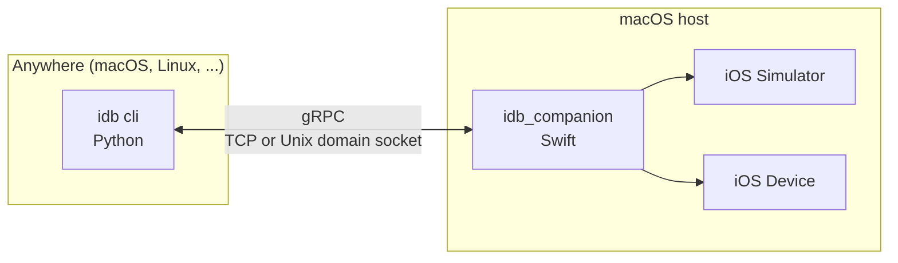
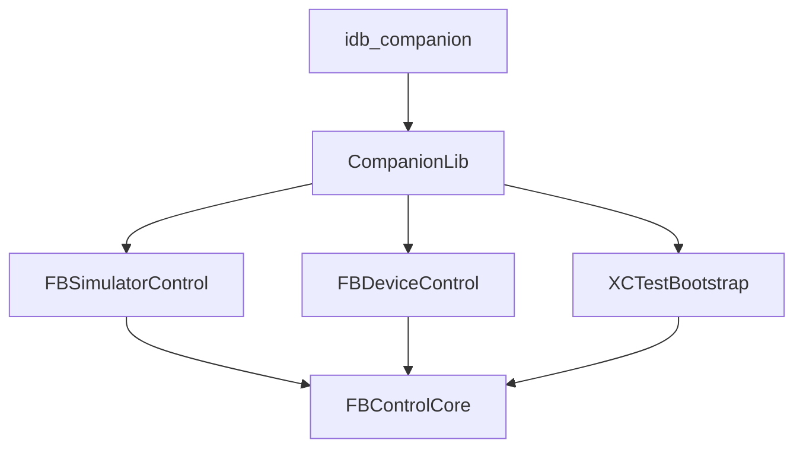

`idb` is formed of two components that have different responsibilities. Both these components are necessary for `idb` to run commands.

## The `idb` cli

This is a python3 cli that exposes all of the functionality that idb has to offer. As it is written in Python, this does not need to be run from the Mac to which your iPhone or iOS Simulator is attached.

The cli itself is a thin wrapper for a client of the `idb_companion`. All communication to the `idb_companion` is done via `gRPC`. This can be either through TCP or a Unix Domain Socket.

This client library can be imported into your own python3 code if you wish, or the CLI can be called from any other kind of automation.

## The `idb_companion`

The `idb_companion` is a `gRPC` server, written in Swift, that runs on macOS. It talks to the native APIs that are used for automating Simulators and Devices. It links the `FBSimulatorControl` and `FBDeviceControl` Frameworks, which are part of the overall `idb` project.

When the `idb_companion` acts as `gRPC` server, it does so for a *single* iOS target (a device or simulator).

Additionally, the `idb_companion` has some commands that are deliberately unavailable from the python CLI, these operations are related to iOS Device management or operations on the lifecycle of a Simulator.

## Connections

The `idb` cli will, by default operate in one of two modes:

- If the `idb` cli is running on macOS, then it will automatically start and stop companions for all targets that are attached to your Mac. This means that you can run commands against any iOS Simulators that you have, as well as any devices that you have connected.
- If the `idb` cli is running on any other OS, it will not manage companions for you. In this case you can either "attach" companions via `idb connect` or explicitly on every call using the `IDB_COMPANION=hostname:port` environment variable. This allows you to perform `idb` commands against companions running on other hosts. These facilities for companion discovery work on macOS also.

## The transition to pure Swift

`idb` is transitioning to a pure Swift codebase. This is an ongoing migration, and the current state is:

- **The `idb_companion` is Swift.** The companion executable, its gRPC server and all of its request handling are implemented in Swift, replacing the previous Objective-C++ implementation that was built against the C++ gRPC library. The server is built on [`grpc-swift`](https://github.com/grpc/grpc-swift) and SwiftNIO.
- **The Frameworks are migrating.** `FBControlCore`, `FBSimulatorControl`, `FBDeviceControl` and `XCTestBootstrap` are a mix of Objective-C and Swift. New functionality is written in Swift, and existing functionality is progressively rewritten. Objective-C remains concentrated where `idb` binds C or Objective-C system API directly: the `MobileDevice.framework` layer in `FBDeviceControl`, the `DTX` protocol layer in `XCTestBootstrap`, process spawning and `FBFuture` itself.
- **New components are Swift-only.** `idb-repl` and the companion's supporting libraries are pure Swift. `idb-repl`'s whole dependency closure contains no Objective-C, which is what allows it to be built with the Swift Package Manager and cross-compiled for Linux.

For consumers of the Frameworks this means that newer APIs are exposed as Swift protocols with `async` methods, while older APIs return an `FBFuture`. The two interoperate: Swift code awaits `FBFuture`-based APIs through bridging described in [`FBFuture` and Swift Concurrency](#fbfuture-and-swift-concurrency) below.

## Differences between Devices, Simulators & Emulators

iOS Devices and Simulators behave in substantially different ways, as well as Simulators behaving very differently to Emulators (for instance Android emulators):

- iOS Simulators and their child processes, appear as regular processes on the host operating system.
- iOS Simulators run executables that are native to macOS. This is unlike emulators for Android which may run across a variety of host operating systems, will always run native Android executables and may translate [between ISAs](https://en.wikipedia.org/wiki/Instruction_set_architecture).
- As iOS Simulators appear as native processes to macOS, many of the macOS level APIs for interacting with files and processes work just the same. This is useful in implementing Simulator functionality. The iOS Simulator uses the same kernel as the host macOS, which also goes some way to explain that some Xcode versions have increased macOS version requirements (there may be new kernel functionality in newer iOS versions that means that Simulators require this functionality through a macOS upgrade).
- iOS Simulators do not use exactly the same system frameworks as macOS. These Frameworks are implemented in the "Simulator Runtime" that is bundled within Xcode. The runtime contains Frameworks that are broadly the same as those on an iOS Device, except they are compiled for the macOS host architecture.
- As Simulators run natively, they have similar performance characteristics to that of the host. In a sense Simulator Applications perform in a similar way to a macOS application running on macOS. This usually means that Simulators are substantially more performant than emulators, even when an emulator has access to a hypervisor and is running the same ISA.
- iOS Simulators have the concept of a "root" directory, which can be thought of as the Simulator's Filesystem. Applications running inside the Simulator still have access to files outside of this root (there is no [`chroot`'ing](https://en.wikipedia.org/wiki/Chroot) inside of the Simulator), so are able to manipulate files that are outside of this root. Applications are also able to manipulate files outside of their own "Application Sandbox" which is not the case on iOS Devices.
- This lack of isolation in iOS Simulators is a double edged sword. It can make certain automation cases more convenient to implement, but it is not easy to ensure that a Simulator has access to a limited amount of system resources. For example, emulators typically allow setting an upper limit on the number of cores or memory that can be consumed by the "guest" OS, where iOS Simulators can access the same resources that any application on the host can. This makes it harder to isolate multiple iOS Simulators running on the same host from each other. For instance, an iOS Simulator Application that consumes extreme amounts of system resources will exhaust these resources for other applications, processes or Simulators running on the same host.
- iOS Devices are very strict about isolating processes from each other as well as the host to which it is attached. Interaction between the host and attached iOS Device is only possible through purpose-built APIs that expose functionality for existing host-device behaviours. For instance, iOS App launching is implemented on iOS Devices through APIs that are used by the "Instruments" Application. This functionality is typically provided over a socket transport, with varying different protocol implementations depending on the domain. Access to these services is arbitrated via a `lockdown` service running on the iOS Device.
- As such, the implementations for functionality across iOS Simulators & Devices are drastically different, even within Xcode's own Frameworks.

## Framework Concepts

There are two frameworks in `FBSimulatorControl` and `FBDeviceControl` that exist to implement the majority of the functionality used by `idb`. Additionally, there is the `FBControlCore` Framework that exists to define common interfaces for the Device and Simulator Frameworks and to provide other functionality that is common to both. These Frameworks are able to be used independently of `idb` itself. This is an overview of how these Frameworks are designed together.

### Targets

A instance of a target (`FBiOSTarget`) is an object that represents a single iOS Simulator or Device. `FBiOSTarget` is a protocol definition that describes the functionality that is implemented by both `FBSimulator` and `FBDevice`. This abstraction means that higher-level applications and Frameworks are able to treat a target the same, regardless of whether it is an iOS Simulator or Device.

As there are substantial differences in the way that iOS Simulators and Devices operate, this level of abstraction allows the Frameworks to smooth over the differences present in implementing common functionality.

### Target Sets

A "Target Set" (`FBiOSTargetSet`) represents a collection of targets. These are implemented in both `FBSimulatorSet` and `FBDeviceSet`. A Simulator set represents a root directory that is common to a number of Simulators. A Device Set represents all of the Devices attached to the host.

This abstraction allows for interfaces to "CRUD" operations on both Simulators and Devices, despite having different implementations. For instance the same API is used across Simulators and Devices for `erasing` them.

### Configuration Values

Across the Frameworks, there are "Configuration" values. These are typically used for consolidating all the information required for a particular API call. For instance `FBApplicationLaunchConfiguration` defines launch arguments, environment and launch modes.

These types exist so that APIs do not require extremely long and cumbersome argument lists, as well as providing sane defaults. These types are intentionally as behaviour-less as possible, close to pure value types.

### Command Protocols & Implementations

In order to keep a common API between Simulators and Devices, `idb` has a set of protocols that define an interface for separate implementations across iOS Simulators & Devices. This does encourage the creation of well thought-out APIs. The `idb_companion` can be agnostic to the underlying iOS target, instead interacting with these protocols. Older protocols are defined in Objective-C and expose their asynchronous work as an `FBFuture`; newer protocols are defined in Swift with `async` methods.

There may be some protocols that are only supported by one or the other, depending on the target. For instance there is no concept of "Activation" on an iOS Simulator, so `FBDeviceActivationCommands` is only implemented by `FBDevice`. Where a target does not support a given protocol, `idb` will fail when these APIs are called, giving an error message that explains what functionality is missing.

Implementations across Simulators & Devices are completely separated and implemented in their respective Frameworks. As an example, `FBApplicationCommands` (which provides an API for launching and listing Applications on an iOS Target), is implemented separately in `FBSimulatorApplicationCommands` and `FBDeviceApplicationCommands`.

If functionality is common to both Simulators & Devices, its protocol is added to `FBiOSTarget` so that implementors of `FBiOSTarget` are required to implement it. For functionality that is not common, the relevant protocol is added to the definition of the concrete `FBSimulator` or `FBDevice` class. For non-common protocols, the caller must either check for protocol conformance before calling an API, or use the concrete type directly.

### Logging

`FBControlCoreLogger` is used throughout the codebase. This provides a common interface for logging out to system level loggers as well as files. Since all these Frameworks may be used in a variety of different scenarios, included where a logging client may be remote, this abstraction provides a common way of directing logs to the appropriate place. This is an "unstructured logger", which receives arbitrary strings.

There are also classes that are used for intercepting internal calls (`FBLoggingWrapper`) and logging them out to a "structured logger" (`FBEventReporter`). This is used in `idb` to produce accurate logging of all API calls that are made in the server. This supports user-defined classes, so is ideal for pushing into datastores that support aggregation.

### IO

Due to the nature of the functionality that is offered in the Frameworks, IO is a very common task. There are a number of abstractions for reading and writing data between various sources and sinks. For example, the common interface (`FBFileReader`) is used to read output from a spawned Application process and relay it to a consumer (`FBFileWriter`). This is then used to pipe Application output over `idb`'s gRPC interface without the Application launcher having to be aware of what is consuming the output.

All of this is backed by `libdispatch`, due to its affordance for asynchronous IO, where file reading and writing is managed in an efficient manner without the user having to build their own IO multiplexer.

### `FBFuture` and Swift Concurrency

A huge amount of the "work" that is done inside the Frameworks is based on IO and calling out to other APIs that perform IO. This work is very asynchronous, which means that there is a strong case for a consistent API for performing and waiting on this work.

The Objective-C parts of the Frameworks predate `async`/`await` in Swift, so they encapsulate asynchronous work in the `FBFuture` class:

- **Error conditions**. Nearly all of the asynchronous operations represented by a `FBFuture` are fallible in some way, so an `FBFuture` can be resolved to an error state with a full `NSError`.
- **Chaining**. A single high-level API may be formed of a sequence of asynchronous calls that occur one after another. The `FBFuture` syntax provides a way of threading these all together in a quasi-imperative way.
- **Queues must be always defined**. In order to prevent unintended behaviour, where an async callback is called on an arbitrary or private queue, any consumer of an `FBFuture` must provide the queue that the callback will be called on. This is also true of chaining, which promotes the separation of queues that are used for serializing calls to other APIs or queues that are used for background behaviour that can be performed on any thread. For example, all calls to `CoreSimulator` must be serialized on the same thread but work in a Future that performs pure data transformation with no side-effects can be performed on an arbitrary background queue.
- **No waiter thread**. All resolution of Futures is performed asynchronously, there does not need to be a thread or queue waiting on the resolution of a Future. This means that if multiple Futures are running concurrently there is not a danger of thread exhaustion.

Swift code in `idb` uses Swift Concurrency (`async`/`await`) instead. The two worlds are bridged: [`CompanionLib`'s `BridgeFuture`](https://github.com/facebook/idb/tree/main/CompanionLib/BridgeFuture) awaits `FBFuture`-based Framework APIs from Swift `async` contexts, so the companion's Swift request handling composes with the Objective-C core. As the migration to Swift progresses, `FBFuture` recedes towards the Objective-C code that remains; a consumer of `idb` need not be aware of these details, as they are internal to the implementation of the `idb_companion`.

## `idb_companion` concepts

The majority of what the `idb_companion` does is to act as a gRPC server to all the functionality across the `FBSimulatorControl` and `FBDeviceControl` Frameworks. The server and all of its request handling are written in Swift.

It does have a handful of components that are important to the way that it operates.

### [`main.swift`](https://github.com/facebook/idb/blob/main/Companion/main.swift)

This is the entrypoint to the `idb_companion` and includes all of the various flags that are supported by it. This is used for specifying how the gRPC server should be started for a given iOS Target.

Additionally, it exposes a number of "CRUD" commands that are destructive for managing Simulators and Devices, for example `--create`, `--erase` and `--delete`. These commands are intentionally left out of the gRPC interface, to prevent unwanted behaviour. If you wish to perform destructive commands, these must be performed on the host where the iOS Simulators or Devices are present.

### [`GRPCSwiftServer`](https://github.com/facebook/idb/blob/main/Companion/SwiftServer/GRPCSwiftServer.swift)

This is the gRPC server itself, built on [`grpc-swift`](https://github.com/grpc/grpc-swift) and SwiftNIO. It binds the [`idb.proto` interface](https://github.com/facebook/idb/blob/main/proto/idb.proto) on a TCP port or Unix domain socket, optionally over TLS.

### [Method handlers](https://github.com/facebook/idb/tree/main/Companion/SwiftServer/MethodHandlers)

Each RPC in the `idb.proto` interface is implemented by its own Swift method handler, for instance `InstallMethodHandler` or `AccessibilityInfoMethodHandler`. A handler translates the request's protobuf types into the value types used by the Frameworks, awaits the underlying work with Swift Concurrency, and translates the result back into a protobuf response. This keeps each RPC's implementation small, isolated and testable.

### [`FBIDBCommandExecutor`](https://github.com/facebook/idb/blob/main/CompanionLib/FBIDBCommandExecutor.swift)

This provides a facade over the many APIs in the underlying Frameworks, so that the method handlers do not need to be aware of how they operate. It lives in `CompanionLib`, which also contains the storage management for installed artifacts and the bridging between `FBFuture` and Swift Concurrency.
