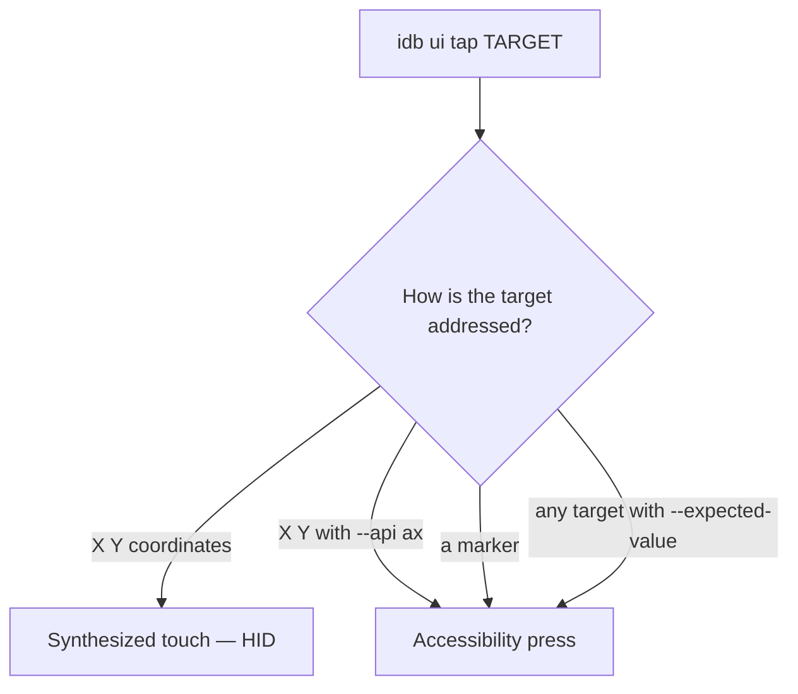

`idb ui` is the command group for everything that reads or drives the screen. It covers two kinds of operation that are easy to confuse:

- **Accessibility operations** ask the target's accessibility system what is on screen, and act on the *elements* it reports. `describe-all`, `describe-point`, `describe`, `scroll` and `set-value` are always accessibility operations; `tap` can be one.
- **HID operations** synthesize the events a physical finger, keyboard or button would produce. They operate on coordinates, not elements.

Accessibility operations are currently supported on iOS Simulators only. HID operations work on Simulators, and a subset works on Devices.

## Addressing the screen

Most of the group accepts a **target**, and there are three ways to name one:

| Target | Written as | Meaning |
|--------|-----------|---------|
| A point | `X Y` — two integers | A coordinate in the screen's points coordinate system, with the origin at the top left |
| A marker | a single string | The first element whose `--match-key` attribute *contains* this string |
| The frontmost app | omitted | The whole foreground application. Only where the command's target is optional |

Matching is a substring match, not equality, so `General` matches an element labelled `General Settings`.

Two integers are always read as a point. Quote a marker that looks like a coordinate pair:

```
# The element at (12, 40)
idb ui describe-point 12 40
# The element labelled "12 40"
idb ui describe '12 40'
```

`--match-key` chooses which attribute a marker is matched against. It defaults to `AXLabel`, and accepts `AXLabel`, `AXUniqueId`, `AXValue`, `title`, `role`, `role_description`, `subrole`, `help` and `placeholder`.

`--depth` bounds how far into the element tree a marker search descends, defaulting to `10`. Raise it for a marker nested inside a deep hierarchy; lower it to make a search over a large screen cheaper.

## Reading the screen

The three read commands differ only in what they are asked about — they share their options, their output schema, and the backend that serves them.

### `idb ui describe-all`

Describes every element of the frontmost application.

```
idb ui describe-all
```

The output is JSON on a single line. Pipe it through [`jq`](https://stedolan.github.io/jq/) to read it:

```
$ idb ui describe-all | jq '.[] | select(.AXLabel != null) | {AXLabel, type, frame}'
{
  "AXLabel": "General",
  "type": "Button",
  "frame": { "y": 264, "x": 20, "width": 362, "height": 44 }
}
{
  "AXLabel": "Accessibility",
  "type": "Button",
  "frame": { "y": 308, "x": 20, "width": 362, "height": 44 }
}
```

`--key` restricts which attributes are reported, and is repeatable. Fetching an attribute costs a round trip to the target's accessibility system, so narrowing a whole-screen read to the attributes you need is significantly faster than reading everything and discarding most of it:

```
idb ui describe-all --key AXLabel --key frame
```

### `idb ui describe-point X Y`

Describes the single element at a point — a hit test.

```
$ idb ui describe-point 201 286 | jq '{AXLabel, type}'
{
  "AXLabel": "General",
  "type": "Button"
}
```

In the `default` and `nested` formats a whole-screen read emits an array where this emits a bare object, or `null` when nothing is at the point. `--format complete` always emits an array, whichever command produced it.

### `idb ui describe MARKER`

Describes the single element matching a marker.

```
$ idb ui describe General | jq '{AXLabel, AXUniqueId, type}'
{
  "AXLabel": "General",
  "AXUniqueId": "com.apple.settings.general",
  "type": "Button"
}
```

Match against an attribute other than the label with `--match-key`:

```
idb ui describe com.apple.settings.general --match-key AXUniqueId
```

### Options shared by the read commands

| Option | Applies to | Description |
|--------|-----------|-------------|
| `--api {ax,axbridge}` | all three | Which backend serves the read. See [Accessibility](accessibility.mdx) |
| `--format {default,nested,complete}` | all three | The output format. See [Accessibility](accessibility.mdx) |
| `--nested` | all three | Deprecated alias for `--format nested` |
| `--key KEY` | `describe-all`, `describe-point` | Report only this attribute; repeatable |
| `--profile` | `describe-all`, `describe-point` | Collect timings and counts for the read, reported in the `complete` format. See [Accessibility](accessibility.mdx#reading-profile) |
| `--collect-frame-coverage` | `describe-all`, `describe-point` | Collect screen-coverage ratios for the read's element frames, reported in the `complete` format |
| `--match-key KEY` | `describe` | Attribute the marker is matched against, default `AXLabel` |
| `--depth N` | `describe` | Maximum tree depth searched for the marker, default `10` |

## Acting on elements

These commands resolve a target through the accessibility system and then perform the action the platform itself would perform. They are not synthesized touches: an accessibility press activates the element directly, so it does not depend on where the element is on screen at the moment of the press.

### `idb ui tap`

`tap` can be either a HID operation or an accessibility operation, depending on how the target is addressed:



```
# Coordinate tap, delivered as a synthesized touch
idb ui tap 201 286
# The same coordinate, delivered as an accessibility press of whatever is under it
idb ui tap 201 286 --api ax
# A marker — always an accessibility press
idb ui tap General
```

A marker is always resolved through the accessibility system; passing `--api hid` with one is rejected rather than silently ignored.

`--duration` holds the touch down for a given time, and is only meaningful for a coordinate touch. An accessibility press is instantaneous, so `--duration` is rejected there rather than silently ignored.

`--expected-value` guards the tap. The element must report that value for `--expected-key` (default `AXLabel`) or the tap is refused, leaving the screen where it was:

```
idb ui tap com.apple.settings.general --match-key AXUniqueId --expected-value General
```

Because the guard has to read the element before acting, passing `--expected-value` moves even a coordinate tap onto the accessibility path.

### `idb ui scroll DIRECTION [TARGET]`

Scrolls an element, or the frontmost application when no target is given.

```
# Scroll the frontmost app down
idb ui scroll down
# Scroll a specific element
idb ui scroll up 'Notification Center'
idb ui scroll left 201 286
```

`DIRECTION` is one of `up`, `down`, `left`, `right` or `visible`. `visible` scrolls the target into view rather than in a direction. `--match-key` and `--depth` apply to a marker target.

### `idb ui set-value TARGET --value VALUE`

Sets an element's accessibility value — the direct way to fill a text field or move a slider, with no keyboard involved.

```
idb ui set-value 'Search' --value 'hello world'
idb ui set-value 201 286 --value 'hello world'
```

Unlike `scroll`, a target is required: there is no sensible value to set on a whole application. `--match-key` and `--depth` apply to a marker target.

## Synthesizing input

These commands emit HID events. They take coordinates, not elements.

### `idb ui multi-tap X Y`

Taps repeatedly at a point, defaulting to a double tap.

```
idb ui multi-tap 201 286
idb ui multi-tap 201 286 --count 3 --pause 0.05
```

`--count` sets the number of taps (default `2`), `--pause` the gap between them in seconds (default `0.1`), and `--duration` how long each touch is held.

### `idb ui swipe X_START Y_START X_END Y_END`

Touches down at the start point, moves to the end point, and lifts.

```
idb ui swipe 100 500 100 100
```

The touch is moved in steps; `--delta` sets the distance in points between successive touch points along the line, and `--duration` sets how long the whole gesture takes.

### `idb ui pinch X Y SCALE`

A two-finger pinch centred on a point. A scale above `1.0` zooms in, below `1.0` zooms out.

```
# Zoom in around the centre of the screen
idb ui pinch 201 437 2.0
# Zoom out slowly, with the fingers starting further apart
idb ui pinch 201 437 0.5 --duration 1.0 --radius 150
```

`--radius` is the initial distance of each finger from the centre in points (default `100.0`), and `--duration` the length of the gesture in seconds (default `0.5`).

### `idb ui button BUTTON`

Presses a hardware button: one of `APPLE_PAY`, `HOME`, `LOCK`, `SIDE_BUTTON` or `SIRI`.

```
# Send the target to the lock screen
idb ui button LOCK
# Hold the side button
idb ui button SIDE_BUTTON --duration 2
```

### `idb ui remote ACTION`

Sends a Siri Remote action for tvOS focus navigation: one of `up`, `down`, `left`, `right`, `select` or `menu`. Arrows move focus, `select` activates the focused element, and `menu` goes back.

```
idb ui remote down
idb ui remote select
```

### `idb ui text TEXT`

Types text, as a hardware keyboard would. It takes a single argument, so text containing spaces must be quoted.

```
idb ui text 'hello world'
```

### `idb ui key KEYCODE`

A short press of a single [USB HID keyboard usage code](https://usb.org/document-library/hid-usage-tables-16).

```
# Return
idb ui key 40
# Command-A
idb ui key 4 --command
```

Modifiers are held for the duration of the press: `--shift`, `--control`, `--option`, `--command`, and `--tab` for [iOS Full Keyboard Access](https://support.apple.com/en-gb/guide/iphone/ipha4375873f/ios). `--duration` sets how long the key is held.

### `idb ui key-sequence KEYCODE...`

Presses several keycodes in order.

```
idb ui key-sequence 4 5 6
```

### `idb ui rotate ORIENTATION`

Rotates the target to `PORTRAIT`, `PORTRAIT_UPSIDE_DOWN`, `LANDSCAPE_LEFT` or `LANDSCAPE_RIGHT`.

```
idb ui rotate LANDSCAPE_LEFT
```

### `idb ui shake`

Sends a shake gesture — the one that triggers "Shake to Undo", and the motion event many apps hang a debug menu off.

```
idb ui shake
```

## Building a loop

The read and act commands compose: read the screen, then address elements by marker rather than hardcoding coordinates that vary with device size and layout:

```
# Wait for a button to appear, then press it
until idb ui describe 'Get started' > /dev/null 2>&1; do sleep 0.5; done
idb ui tap 'Get started'

# Fill a field and submit, guarding that we are on the screen we think we are
idb ui set-value 'Email' --value 'user@example.com'
idb ui tap 'Continue' --expected-value 'Continue'
```

`--api axbridge` keeps the companion-owned reader warm between requests, including across separate `idb` invocations; see [Accessibility](accessibility.mdx).
